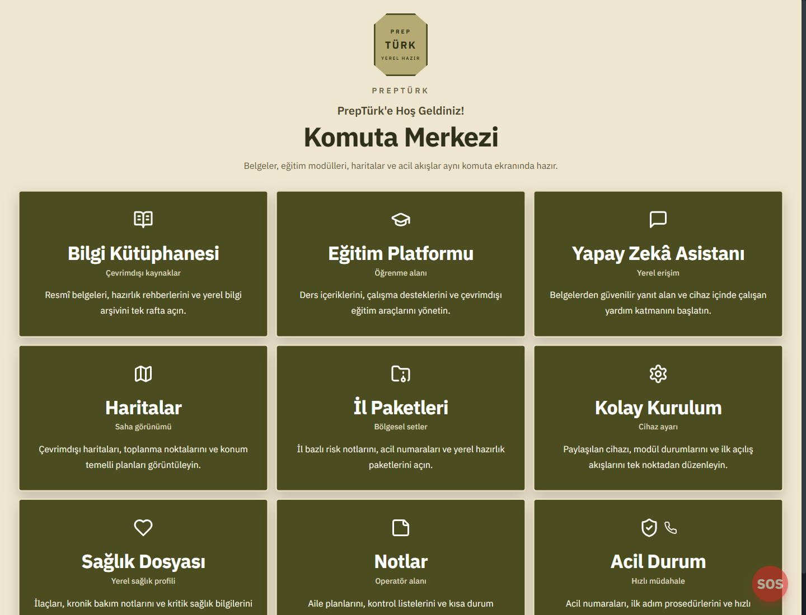
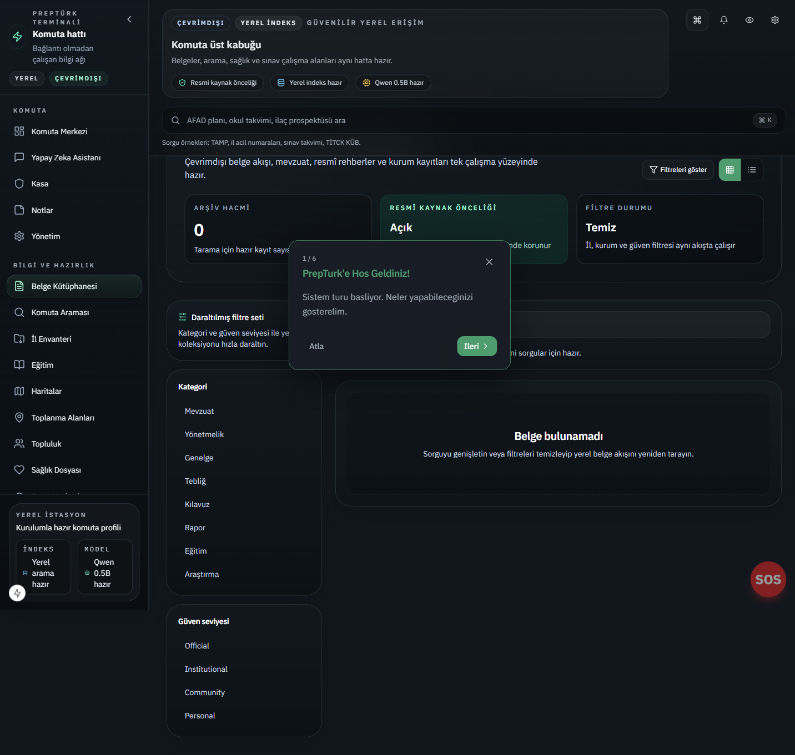
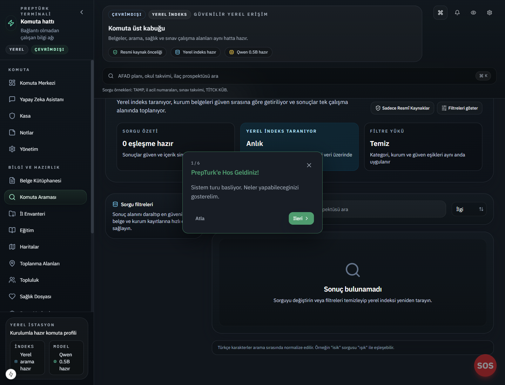
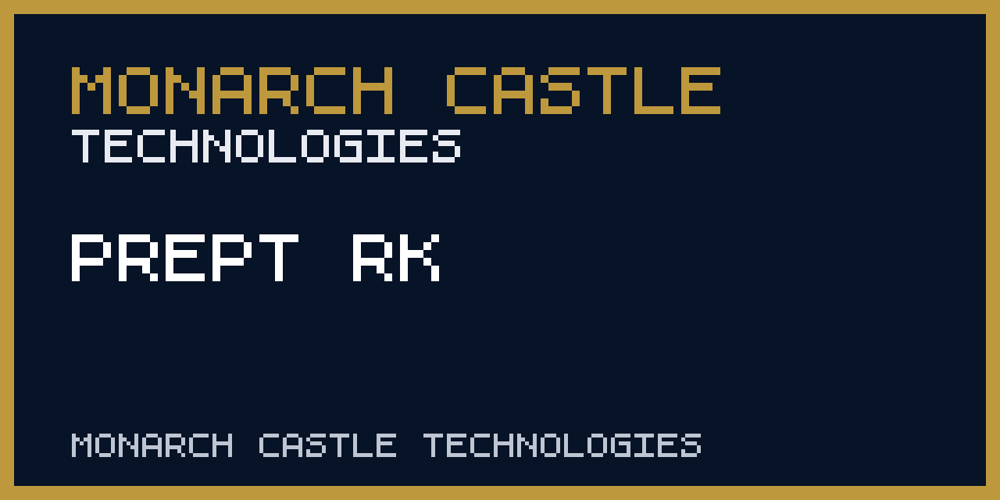

<div align="center">
  <picture><source media="(prefers-color-scheme: dark)" srcset="https://raw.githubusercontent.com/monarchcastletech/prepturk/master/docs/logo-dark.png"></picture>
  <!-- CODEX: an optional brand-standard variant can be generated at docs/logo.png; the live product logo at apps/web/public/logo.png is referenced here. -->

  # PrepTürk
  ### Türkiye's sovereign, airgapped preparedness command center

  <a href="README.md">🇬🇧 English</a> · <a href="README.tr.md">🇹🇷 Türkçe</a> · <a href="README.ru.md">🇷🇺 Русский</a> · <a href="README.ar.md">🇸🇾 العربية</a>

  
  
  
  
  
</div>

> **Executive summary** — PrepTürk is a high-availability, airgapped intelligence and survival orchestration platform engineered for the Republic of Türkiye's geographic and geopolitical risk profile. It turns consumer-grade hardware — a Raspberry Pi, laptop, or home server — into a hardened command center that runs a local LLM over verified government documents, drives real radio and mesh hardware, and operates with **zero internet connectivity**. It serves households, community responders, and field operators who must keep working when the cloud, the grid, and the cell network are gone.

## ✨ Highlights

- **Sovereign local AI** — Retrieval-augmented generation over a library of **36 verified Turkish government source manifests** (AFAD, Ministry of Health, MEB, NDK, MGM, MTA, and more), served entirely on-device via **Ollama** with **Qdrant** semantic search. No queries ever leave the box.
- **Airgap-by-default** — `AIRGAP_MODE` ships enabled; a software-level lock prevents outbound network requests from backend workers. Telemetry is stripped and fonts are served locally.
- **Physical-layer integration** — Native interfaces for **RTL-SDR** (emergency frequency scanning, NOAA weather imagery) and **Meshtastic** LoRa mesh for off-grid SOS and community sync.
- **Verified civil-defense protocols** — AFAD CBRN ("Siyah Alarm") and air-raid ("Kırmızı Alarm") procedures, first-aid libraries, and a conservative medical triage assistant.
- **Provenance-first content pipeline** — every document carries source, rights status, and a content hash; storage mode (mirrored / cached / pointer-only) is governed per-source to respect redistribution rights.
- **Multilingual by design** — fully localized in Turkish, English, Russian, and Arabic to serve all residents and displaced persons in crisis zones.
- **Reproducible deployment** — the entire stack stands up from a clean checkout with `docker compose up -d`; backup, restore, and province-pack tooling included.

## 🖼️ Preview





## 🧭 What it does

PrepTürk consolidates four operational domains into a single self-hosted command center.

### 1. Intelligence & sovereign AI
Local RAG powered by **Ollama** (default `qwen2.5:7b-instruct` for generation, `nomic-embed-text` for embeddings) answers natural-language questions by citing its own offline library of verified Turkish government sources. **Qdrant** provides high-performance vector search across thousands of pages of legislation and emergency manuals — no external index server, no API calls.

### 2. Physical layer & hardware integration
- **SDR (Software-Defined Radio)** — RTL-SDR interface that scans and logs emergency frequencies and decodes weather-satellite imagery.
- **LoRa mesh (Meshtastic)** — node-to-node mesh networking for SOS signals and community boards when cell towers fail.
- **Environmental & CBRN sensing** — local logging hooks for radiation, air quality, and climate data.
- **Local Whisper** — on-device voice-to-text; no audio ever leaves the device.

### 3. Tactical emergency operations
Verified civil-defense procedures, an emergency first-aid library, and a conservative symptom checker. Hyper-local mapping is served from local vector tiles so navigation works without a single packet from the internet.

### 4. Logistics & continuity
Offline file sharing via QR packages and ad-hoc Wi-Fi, inventory and resource tracking with depletion alerts, province-calibrated planning for all 81 provinces, and modules for traditional Anatolian food-preservation and provincial agricultural calendars.

## 🗂️ Data & provenance

Per Monarch Castle doctrine — **evidence before assertion**. PrepTürk's content set is not scraped at random; it is a curated catalogue of **36 source manifests** (`content/manifests/sources/*.yaml`), each declaring its origin, trust level, rights status, and a default storage mode:

| Storage mode | Used for | Behaviour |
| :--- | :--- | :--- |
| **Mirrored** | Public-download official documents (AFAD, Ministry of Health, MEB, Anayasa) | Full local copy of original + extracted text |
| **Cached** | Public-read sources with limited redistribution rights (TİTCK, MGM, MTA, EBA) | Local cache for access; original remains canonical |
| **Pointer-only** | Service portals and pages that must not be scraped | Metadata and source URL only; no auto-redistribution |

Every record carries its source, rights status, and a content hash for integrity verification (`scripts/hash_manifest.py`). Collection respects each source's redistribution terms and Turkish data-protection law. See [`docs/rights-and-provenance.md`](docs/rights-and-provenance.md), [`docs/source-policy.md`](docs/source-policy.md), and [`docs/ingestion.md`](docs/ingestion.md) for the full provenance and ingestion model.

## 🛠️ Tech stack

| Component | Technology | Role |
| :--- | :--- | :--- |
| **Frontend** | Next.js 15 · React 19 · TypeScript · Tailwind · Radix UI | Hardened PWA with service-worker caching |
| **API** | FastAPI · Python 3.12 (async) | High-throughput command layer |
| **Worker** | Python 3.12 ingestion service | Document fetch, extraction, OCR, embedding |
| **Database** | PostgreSQL 16 | Relational metadata and roles |
| **Vector DB** | Qdrant 1.8 | Semantic indexing and similarity search |
| **AI engine** | Ollama | Local LLM + embedding orchestration |
| **Reverse proxy** | Caddy | Internal HTTPS and static serving |
| **Orchestration** | Docker Compose · Makefile | One-command bring-up |
| **CI** | GitHub Actions | ruff · mypy · ESLint · Prettier · pytest · jest |

## 🔒 OPSEC & hardening

PrepTürk follows a **paranoid-by-default** model: airgap enforcement at the worker layer, telemetry stripped from the frontend, a fully local font stack (no external CDNs), and an AES-256-GCM encrypted local enclave for family documents. Database and vector-store ports are not exposed to the host by default.

## 🚀 Getting started

### Prerequisites
- **Hardware:** 4 GB RAM minimum (16 GB recommended for the 7B AI model).
- **Software:** Docker and Docker Compose; a local **Ollama** runtime for AI features.

### Quick launch
```bash
git clone https://github.com/monarchcastletech/prepturk.git
cd prepturk
cp .env.example .env        # review AIRGAP_MODE, model, and secret settings
docker compose up -d
```
Access the command center at `http://localhost:3000` (API on `:8000`).

### Common operations (Makefile)
```bash
make up        # start the full stack
make down      # stop the stack
make test      # backend (pytest) + worker + frontend (jest) tests
make lint      # ruff + mypy + ESLint + Prettier
make backup    # snapshot data; make restore to recover
```

PrepTürk is a self-hosted, airgapped stack — it is **not** a hosted web service and intentionally ships no public cloud endpoint.

## 🧱 Part of Monarch Castle

> A product of **Emergency Intelligence** · **Monarch Castle Technologies** — an operating company of **[Monarch Castle Holdings](https://github.com/MonarchCastleHoldings)**.
> Sister companies: [Monarch Castle Technologies](https://github.com/monarchcastletech) · [Strategic Data Company of Ankara](https://github.com/SDCofA)

## ⚖️ License & responsibility

Licensed under **AGPL-3.0** — see [`LICENSE`](LICENSE).

> **Important:** PrepTürk is a supplementary tool. In any emergency within the Republic of Türkiye, **always prioritize official government directives and call 112**. This software is provided "as is", without warranty of any kind.

<div align="center">
  <i>"Assume nothing will be there when you need it. Own the infrastructure of your survival."</i><br/><br/>
  © 2026 Monarch Castle Holdings · Ankara, Türkiye<br/>
  <sub>🏰 Monarch Castle Holdings — turning open-source noise into lawful, verified, decision-grade intelligence.</sub>
</div>

---

<!-- repository-hygiene:start -->


Türkiye's sovereign, airgapped preparedness command center — local AI (RAG over verified AFAD/Health docs), SDR, and Meshtastic mesh that run with zero internet.


## Repository status

Lifecycle: **Active**. The badge and this statement describe maintenance status, not service availability.

## Public access

This repository is **not publicly deployed**. Use the local quick-start instructions below.

## Screenshots



The preview is maintained as a repository asset; the live interface or generated output remains authoritative.

## Data and methodology

See [docs/rights-and-provenance.md](docs/rights-and-provenance.md) and the implementation files in this repository. Source dates, transformation steps, and known gaps must travel with analytical outputs.

## Update frequency

Release-driven. Offline corpus refresh is an operator-controlled action, not an automatic internet dependency.

## Quick start

```shell
docker compose up --build
```

```shell
python -m pytest -q tests/test_repository_hygiene.py
```

Run only in a trusted development environment and review repository-specific prerequisites before using networked or hardware features.

## Architecture

- `apps/` — implementation or data module.
- `capture_logo.py` — repository entry point or configuration.
- `content/` — implementation or data module.
- `dashboard-after-hierarchy-fix.png` — repository entry point or configuration.
- `dashboard-shell-after-redesign.png` — repository entry point or configuration.
- `dashboard-shell-final-2.png` — repository entry point or configuration.
- `dashboard-shell-final.png` — repository entry point or configuration.

## Tests

```shell
python -m pytest -q tests/test_repository_hygiene.py
```

## Provenance

Original software history is maintained in Git. External datasets, reports, trademarks, screenshots, and assets are not relicensed by this repository; see [THIRD_PARTY_NOTICES.md](THIRD_PARTY_NOTICES.md) before reuse.

## Forecast limitations

This repository does not publish a guaranteed forecast. Any scenarios, scores, or forward-looking language are analytical aids, not facts or advice; review source dates and methodology before use.

## Security

Do not publish vulnerabilities in an issue. Use GitHub's private vulnerability-reporting flow when available, or follow the [organization security policy](https://github.com/MonarchCastleTech/.github/security/policy).

## License

Original repository code and documentation are available under **AGPL-3.0-or-later**; see [LICENSE](LICENSE). That license does not override third-party terms documented in [THIRD_PARTY_NOTICES.md](THIRD_PARTY_NOTICES.md).

## Citation

Use the machine-readable [CITATION.cff](CITATION.cff). Cite the specific commit and, for analytical use, record the data or model snapshot date.

## Masterbrand endorsement

PrepTürk is a Monarch Castle Technologies project. **Part of Monarch Castle Technologies.**

<!-- repository-hygiene:end -->
